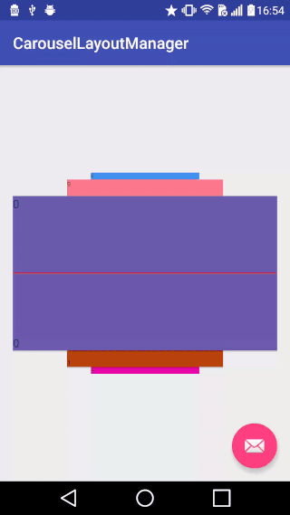
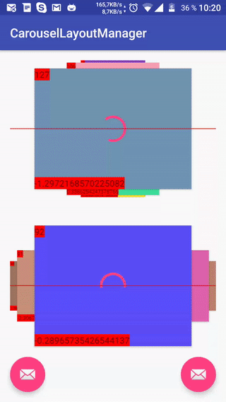

Android LayoutManager for RecyclerView to support Carousel view style
======================

## Examples





## Integration with Gradle

```
    compile 'com.azoft.carousellayoutmanager:carousel:1.1.4'
```

## Description

This LayoutManager works only with fixedSized items in adapter.
To use this LayoutManager copy files that contains in com.azoft.carousellayoutmanager.carousel folder and use this code (you can use CarouselLayoutManager.HORIZONTAL as well):

    final CarouselLayoutManager layoutManager = new CarouselLayoutManager(CarouselLayoutManager.VERTICAL);

    final RecyclerView recyclerView = (RecyclerView) findViewById(R.id.recycler_view);
    recyclerView.setLayoutManager(layoutManager);
    recyclerView.setHasFixedSize(true);

To enable items center scrolling add this CenterScrollListener:

    recyclerView.addOnScrollListener(new CenterScrollListener());

To enable zoom effects that is enabled in gif add this line:

    layoutManager.setPostLayoutListener(new CarouselZoomPostLayoutListener());

Full code from this sample:

    // vertical and cycle layout
    final CarouselLayoutManager layoutManager = new CarouselLayoutManager(CarouselLayoutManager.VERTICAL, true);
    layoutManager.setPostLayoutListener(new CarouselZoomPostLayoutListener());

    final RecyclerView recyclerView = (RecyclerView) findViewById(R.id.recycler_view);
    recyclerView.setLayoutManager(layoutManager);
    recyclerView.setHasFixedSize(true);
    recyclerView.setAdapter(new TestAdapter(this));
    recyclerView.addOnScrollListener(new CenterScrollListener());


#### Contact ####

Feel free to get in touch.

    Website:    http://www.azoft.com
    Twitter:    @azoft
    LinkedIn:   https://www.linkedin.com/company/azoft
    Facebook:   https://www.facebook.com/azoft.company
    Email:      android-mobile@azoft.com

#### License ####

    Licensed under the Apache License, Version 2.0 (the "License");
    you may not use this file except in compliance with the License.
    You may obtain a copy of the License at

       http://www.apache.org/licenses/LICENSE-2.0

    Unless required by applicable law or agreed to in writing, software
    distributed under the License is distributed on an "AS IS" BASIS,
    WITHOUT WARRANTIES OR CONDITIONS OF ANY KIND, either express or implied.
    See the License for the specific language governing permissions and
    limitations under the License.